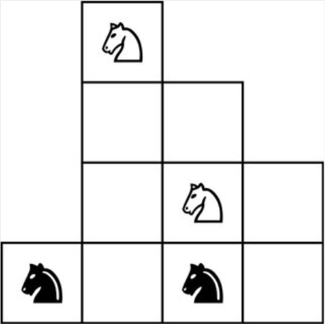

# Original idea

[This](https://twitter.com/thegautamkamath/status/1544691740799557632?s=24&t=1Zb0Ef-M_cSDDnN62G69QA) Twitter post that Alex pointed at, along with this drawing:



The idea is to see how bad it is when we brute force the solution.
A good "side effect" of the brute force approach is that it seems to prove we can visit all possible states from the original layout.

Take it as an attempt to introduce a few software engineering practices, but not too many. In particular, to avoid introducing too many Python concepts we are not using:
- [type annotation](https://docs.python.org/3/library/typing.html) even though we would really want to
- [test fixtures](https://docs.pytest.org/en/6.2.x/fixture.html)

However, we could not resist and used a [property](https://www.programiz.com/python-programming/property).

# Running

```
./chess.py 
*********************
In 41 moves, visiting 1259 layouts (excluding the final one):

 ♘  
 □□ 
 □♘□
♞□♞□

 ♘  
 ♞□ 
 □♘□
□□♞□

 ♘  
 □□ 
 □♘♞
□□♞□

 ♘  
 □□ 
 □□♞
♘□♞□
[...]
```

# Testing

```
python3 -m pytest
```

Or if you are in a hurry and installed `pytest-xdist`:
```
python3 -m pytest -n 3
```

# Developing

Everybody can just use their favorite Python IDE.

"Geeks" can use Docker and VS Code's [devcontainer](https://code.visualstudio.com/docs/devcontainers/containers) extension.
